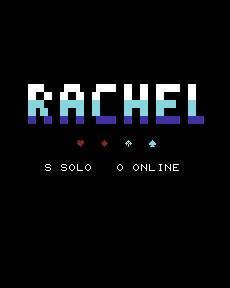
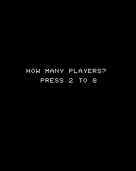
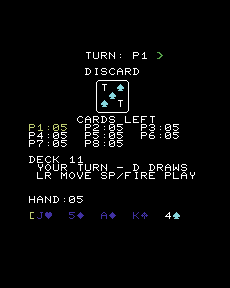
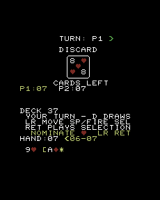

# Rachel VIC-20 Client

A VIC-20 client for the Rachel card game, written in 6502 assembly.

| | |
|---|---|
|  |  |
|  |  |

*Title screen; the solo seat prompt; an eight-seat game with unplayable cards
dimmed; and the Ace suit prompt during an online game. Captured from the
production PRG under Emu198x — `docs/screenshots/` holds the originals.*

## Requirements

- **Hardware**: VIC-20 with 8KB+ memory expansion
- **Video standard**: PAL and NTSC are automatically detected; both network
  timing sets are emulator-verified, with physical verification pending
- **Networking**: ESP8266/ESP32 WiFi modem connected to user port
- **Assembler**: cc65 toolchain (ca65, ld65) for the release build; optionally
  [Asm198x](https://asm198x.github.io) 0.0.53 or newer as a second assembler

## Building

```bash
make clean
make
make test
```

This produces `build/rachel.prg`.

The measured solo-play feasibility work keeps one combined PRG as the primary
design. `make solo-kernel-spike` builds the executable compact-workspace fixture
harness, while `make test` enforces a 2 KiB CODE contingency. See
`docs/SOLO_MEMORY_BUDGET.md` for the stage budgets and disk-menu fallback.

`make release` creates a distributable ZIP and SHA-256 checksum under
`build/release/`, containing the production PRG, instructions and physical
hardware test checklist. See `docs/RELEASE_STATUS.md` for the exact claims and
remaining real-hardware blockers.

### Assembling with Asm198x

[Asm198x](https://asm198x.github.io) assembles this source tree as well, and
`make asm198x-check` is worth running before you trust a change:

```bash
brew install asm198x        # or upgrade: the check needs 0.0.53 or newer
make asm198x-check
```

`src/asm198x.asm` is a compatibility root rather than a second implementation.
It selects a flat layout and then walks the exact production include graph from
`src/main.asm`, so the check assembles the same sources the release does. A
second assembler reading the same code is a cheap way to catch syntax this
project only gets away with because ca65 is lenient — a label written hard
against its directive, for instance, assembles under ca65 and silently fails to
define the symbol under Asm198x.

**ca65 and ld65 stay authoritative for the release PRG.** Asm198x's ca65 path
links a fixed flat segment set, so it does not produce the BASIC stub or the
`vic20-8k.cfg` layout that a real VIC-20 loads. Treat `make asm198x-check` as a
source-compatibility gate, not a second way to build a release.

An older Asm198x fails on `.ifndef` and `.define` and cannot get past
`src/main.asm`. If the check stops on an unsupported directive, upgrade before
assuming the source is at fault.

## Running

Load the program in a VIC-20 emulator (VICE xvic) with 8KB expansion:

```bash
xvic -memory 8k build/rachel.prg
```

Then type `RUN` to start. Choose `S` for a self-contained solo game, which asks
how many seats are at the table and fills the rest with computer opponents, or
`O` for online play. Any table size the rules allow works, from two players to
eight; the hand size follows `GAME_RULES.md`, so eight seats are dealt five
cards each rather than seven.

## Controls

| Key | Action |
|-----|--------|
| ← → | Move cursor |
| SPACE | Select/deselect card |
| RETURN | Play selected cards |
| D | Draw card |
| RUN/STOP | Quit game |

Playing an Ace opens a prompt for the suit it nominates. The cursor keys move
through the four suits, RETURN confirms, and RUN/STOP abandons the play. Both
solo and online use the same prompt: the suit is chosen at the moment the Ace
is played rather than pre-set on a control that is easy to never touch.

Solo play accepts one card at a time: SPACE/fire or RETURN/fire+up plays the
card under the cursor, and only when that exact move is legal. Cards that
cannot be played right now are dimmed. `D`/fire+down draws when drawing is the
enumerated legal action. After the result, `R` deals a fresh game at the same
table size and `O` returns to the mode menu. Online play retains multi-card
selection with SPACE followed by RETURN.

## Memory Map

With 8KB expansion:
- `$1000-$11FF`: Screen RAM (22×23 chars)
- `$1201-$3FFF`: Program code and data (~11.5KB available)

## Hardware Connection

The WiFi modem connects to the VIC-20 user port:
- User-port pin M / VIA CB2: TX (output)
- User-port pin C / VIA PB0: RX (input)
- GND: Ground

The driver waits for the ESP-AT `CIPSEND` prompt before transmitting, and
strips `+IPD`/status text by synchronising received data on the RUBP `RACH`
magic. The ESP-AT link drops to 2400 baud before TCP traffic so the software
UART can receive continuous frames reliably.

### What the client needs from a modem

No physical unit has been through `docs/HARDWARE_TESTING.md` yet, so this is a
specification to check a candidate against rather than a tested endorsement.
The wiring is the easy half — an ordinary C64 user-port serial modem is already
wired correctly for a VIC-20, for the reasons below. The firmware is what
usually needs changing.

**Stock Espressif ESP-AT firmware.** This client drives the ESP's own AT
command set directly — `AT+CIPSTART`, `AT+CIPSEND`, `+IPD`. Most Commodore
user-port WiFi modems instead ship a Hayes-style emulation descended from the
[1200baud](https://1200baud.wordpress.com) firmware, which answers `ATDT
host:port` and knows nothing about `AT+CIPSTART`. Such a board is electrically
fine and functionally wrong until its ESP8266/ESP32 is reflashed with
Espressif's AT build.

**A board that only needs the lettered pins.** These are the same on both
machines, in the same positions: TX on M, RX on C, grounds on A and N, +5V on
pin 2. The signals behind them come from different chips — CB2 and CB1 from the
VIC-20's VIA, PA2 and /FLAG2 from the C64's CIA — but that is inside the
computer and nothing an external board can see. A plain three-wire user-port
serial modem built for the C64 is wired correctly for a VIC-20.

Where the two ports genuinely diverge is the numbered row. VIC-20 pins 4-8 are
JOY0, JOY1, JOY2, light pen and cassette switch, where the C64 puts CIA counter
and serial lines (CNT1, SP1, CNT2, SP2, /PC2). A board reaching for those — some
fast-serial and storage designs do — is C64-only, and on a VIC-20 would be
driving the joystick and cassette lines. A WiFi modem that just needs a UART has
no reason to touch them, but it is the one thing worth confirming.

[Sven Petersen's C64-WiFi-Modem-User-Port](https://github.com/svenpetersen1965/C64-WiFi-Modem-User-Port)
is the reference design this driver's pin mapping targets. It supplies the
5V/3.3V level shifting the user port requires and uses the lettered pins, so
the wiring carries over. Its documentation points at the 1200baud firmware, so
it is the firmware question above that needs answering, not the wiring. Other
user-port boards list VIC-20 support — StrikeLink and the Turbo56K modem among
them — but each carries its own firmware, so ask them the same thing.

Do not connect a bare 3.3V ESP module directly to 5V logic or power. Confirm
regulation, level translation, connector orientation and common ground before
switching on. See `docs/HARDWARE_TESTING.md` before trying physical hardware.

The client observes one VIC-I raster frame at startup and selects independent
PAL or NTSC software-UART timings. Complete online matches pass under both
Emu198x regions. Physical PAL and NTSC verification remain release requirements;
until then the corresponding hardware claims are experimental.

## Platform ID

VIC-20 = `0x000C` (12)

## Protocol

Uses canonical RUBP v2 (Rachel Unified Binary Protocol) 64-byte messages,
including the `WELCOME`, private `GAME_START`/`CARD_DRAWN`/`HAND_SYNC`, and
public `GAME_STATE` flows. Action messages carry RachelSpec v1 metadata.
Every v2 frame carries a CRC-16/CCITT-FALSE checksum over the complete frame;
corrupt inbound frames are discarded and every outbound frame is finalised
immediately before transmission. The ESP-AT link is reduced to 2400 baud before
TCP traffic so the VIC-20 software UART can reliably receive continuous frames.
Full specification: [rachel-multiverse/protocol](https://github.com/rachel-multiverse/protocol).

GitHub Actions builds the PRG and verifies its BASIC `RUN` trampoline, memory
layout, canonical fixture shape, recovery metadata and action encoding on every
change.

Emu198x accepts the PRG, selects the 8KB expansion and executes the BASIC `SYS`
trampoline. Its cycle-driven PB0/CB2 ESP-AT bridge has completed an end-to-end
game turn against the real Go server: HELLO/lobby admission, initial deal,
authoritative state recovery, keyboard `D`, accepted DRAW_CARD, CARD_DRAWN,
turn advancement, and rendering the resulting eight-card hand. The reproducible
input sequence is in `tests/emu198x_draw_e2e.json`; run the Go server locally
with one AI opponent and pass that script to Emu198x's VIC-20 runner.

GitHub Actions also compiles a test-only one-card autoplay PRG. Production PRGs
contain no autoplay code. A complete emulator/server run remains a local test
because VIC-20 ROM images cannot be redistributed to hosted runners.

To run that complete deterministic game, build Emu198x's release VIC-20 runner,
set `EMU198X_DIR` to its checkout, and run `make e2e-full-game`. The adjacent
Go server checkout is used by default; override it with `RACHEL_SERVER_DIR`.
Logs and the final screenshot are retained under `build/e2e-output/`. The test
requires the server to finish and rejects any run containing a client error.
`make e2e-eight-player` runs the same production path with seven AI opponents
and retains its independent evidence under `build/e2e-output-8/`.
`make e2e-full-game-ntsc` runs the same complete match under NTSC timing and
retains its evidence under `build/e2e-output-ntsc/`.
`make e2e-reconnect` uses a TCP proxy to sever an active match, requires the Go
server to report that the original player was reclaimed, and then completes
the game. It uses 300 ms host frame spacing, slightly above the approximately
267 ms needed to receive a complete 64-byte frame at 2400 baud.

For a reproducible presentation recording of the same authentic emulator run,
install `ffmpeg` and run `make capture-video` with `EMU198X_DIR` set. This saves
sampled emulator frames, logs, the replayable session, a poster image and an
H.264 MP4 under `build/video-capture/`. The default is a roughly 44-second,
4x nearest-neighbour recording; `RACHEL_CAPTURE_EVERY`, `RACHEL_CAPTURE_FPS`
and `RACHEL_CAPTURE_SCALE` can tune its pacing and output size.

The checksum lets the VIC-20 safely retain the server's authoritative state hash
and include it with play, draw and recovery requests. The server can therefore
reject actions based on stale state instead of relying on syntax alone.

## Screen Layout

The VIC-20's 22×23 character display is used as:
- Line 0: Turn indicator and play direction
- Lines 2-7: PETSCII discard card
- Lines 8-11: Public card counts for all eight seats
- Line 12: Pending attack, and how it can be answered
- Line 13: Draw deck size and any live Ace nomination
- Lines 14-16: Turn state and controls
- Line 17: Ace suit prompt, while it is open
- Line 18: Hand size and which page of a long hand is shown
- Line 19: Transient feedback
- Line 20: Player's hand

A hand longer than five cards pages, and line 18 reports the visible slice with
arrows for the cards either side of it.

Keyboard and joystick are both supported. Left/right moves through the hand. In
Solo, Space/Fire or Return/Fire+up plays the card under the cursor. Online,
Space/Fire selects cards and Return/Fire+up plays the selection. `D`/Fire+down
draws. Short, non-blocking sound cues acknowledge movement, selection, actions,
errors and the final result.

If an established TCP link closes, the client retains its opaque session token
and assigned game ID, reconnects automatically, reclaims the same seat and
requests an authoritative public/private state refresh. Three automatic tries
are followed by a manual retry-or-quit prompt.

## Files

- `src/main.asm` - Entry point and main loop
- `src/equates.asm` - Constants and memory addresses
- `src/display.asm` - Screen output routines
- `src/input.asm` - Keyboard handling
- `src/rubp.asm` - RUBP protocol implementation
- `src/game.asm` - Game rendering
- `src/sound.asm` - Non-blocking sound cues
- `src/connect.asm` - Connection handling
- `src/net/wifi.asm` - WiFi modem driver
- `src/solo.asm` - Assembly root for the offline game
- `src/solo/layout.asm` - Compact workspace binding and kernel descriptor
- `src/solo/ui.asm` - Offline front end
- `src/solo/api.asm` - Kernel entry points and RKS2 persistence
- `src/solo/actions.asm` - Action catalogue and application
- `src/solo/deck.asm` - Packed deck, shuffle and deal
- `src/solo/rules.asm` - Rule queries, turn order and action enumeration
- `src/solo/state.asm` - Private tables and static storage
- `src/solo/fixtures.asm` - Test-only fixtures, absent from production builds
